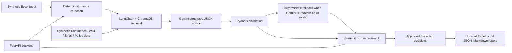

# Tariff Intelligence Agent Demo

Synthetic technical-interview demo of an enterprise tariff data remediation workflow. It mirrors a pattern where analysts maintain telecom tariff and pack data in Excel, while an AI-assisted review process detects bad records, retrieves policy evidence, proposes structured corrections, and applies only human-approved changes.

No real company, customer, tariff, or internal knowledge-base data is included.

## Business Problem

Telecom analytics teams often receive Excel files with missing, outdated, or conflicting tariff fields. Before reports can be trusted, analysts need to verify values against Confluence pages, wiki rules, and email updates. This demo automates that workflow while preserving human approval before any spreadsheet mutation.

## Architecture



## Data Flow

1. `data/input/tariff_packs.xlsx` is loaded with `pandas` and `openpyxl`.
2. Deterministic tools detect missing fields, invalid activation codes, duplicate names, stale dates, price anomalies, tariff mismatches, and known synthetic value mismatches.
3. Knowledge-base Markdown files are chunked and indexed in local ChromaDB using a deterministic hashing embedding, so no external embedding API is required.
4. The agent retrieves evidence and asks Gemini for one strict JSON `ProposedUpdate` per issue.
5. If `GEMINI_API_KEY` is missing or the model returns invalid JSON, deterministic fallback logic generates structured proposals.
6. Analysts approve or reject proposals in Streamlit or through the FastAPI `/review` endpoint.
7. `/apply-approved` writes approved updates to `data/output/updated_tariff_packs.xlsx` and produces `audit_log.json` plus `review_report.md`.

## Tech Stack

- Python 3.11+
- FastAPI backend
- Streamlit frontend
- Gemini via `google-genai`
- LangChain + ChromaDB for local retrieval
- Pydantic for structured data contracts
- pandas + openpyxl for Excel I/O
- pytest for test coverage
- python-dotenv for local configuration

## Run Locally

```bash
python -m venv .venv
source .venv/bin/activate
pip install -r requirements.txt
cp .env.example .env
```

Optional Gemini setup:

```bash
# Edit .env and add:
GEMINI_API_KEY=your_key_here
GEMINI_MODEL=gemini-2.5-flash
```

Start the backend:

```bash
uvicorn app.main:app --reload
```

Start the review UI in a second terminal:

```bash
streamlit run ui/streamlit_app.py
```

If the backend runs on a different URL:

```bash
API_BASE_URL=http://localhost:8001 streamlit run ui/streamlit_app.py
```

## API Workflow

```bash
curl http://localhost:8000/health
curl -X POST http://localhost:8000/ingest
curl -X POST http://localhost:8000/process
curl http://localhost:8000/records
curl http://localhost:8000/proposals
curl -X POST http://localhost:8000/review \
  -H "Content-Type: application/json" \
  -d '{"pack_id":"PK001","field_name":"price_azn","decision":"approved","reviewer":"demo","reasoning":"Evidence supports the correction."}'
curl -X POST http://localhost:8000/apply-approved
curl http://localhost:8000/report
```

## Demo Script

1. Show `data/input/tariff_packs.xlsx` and point out messy records such as missing price, invalid activation code, stale dates, duplicate pack names, and conflicting status.
2. Start FastAPI and Streamlit.
3. Click **Build Knowledge Index**.
4. Click **Run Tariff Analysis**.
5. Filter proposed updates by risk or confidence.
6. Approve a low-risk update, such as `PK001 price_azn -> 12.90`.
7. Reject a different proposal to show that rejected values stay out of the workbook.
8. Click **Apply Approved Updates**.
9. Download `updated_tariff_packs.xlsx`, `audit_log.json`, and `review_report.md`.

## Fallback Mode

The demo runs without Gemini. When `GEMINI_API_KEY` is absent, the provider uses deterministic synthetic reference values and retrieved evidence metadata to produce valid `ProposedUpdate` objects. This keeps the review UI, Excel mutation, audit trail, and tests fully functional offline.

## Key Technical Decisions

- Excel mirrors the analyst workflow and avoids hiding the business problem behind a custom database.
- ChromaDB provides local retrieval without paid search or hosted vector infrastructure.
- Deterministic hashing embeddings keep the demo self-contained and reproducible.
- Pydantic validates model outputs before proposals enter the review workflow.
- Human approval is mandatory before writing any output workbook.
- Audit artifacts are file-based JSON and Markdown so the demo is easy to inspect in an interview.

## Tests

```bash
python -m pytest
```

Current coverage focuses on schema validation, deterministic issue detection, fallback proposal generation, and approved-only Excel mutation.
