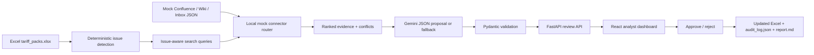

# Tariff Intelligence Agent Demo

Synthetic technical-interview demo of an enterprise tariff remediation workflow. Analysts start with an Excel tariff file, the agent detects bad rows, searches mock enterprise sources, proposes structured updates with evidence, routes changes to human review, and writes only approved updates to a new Excel workbook.

No real company data is included. No real Confluence, Gmail, IMAP, Atlassian, or enterprise connector is used.

## Business Problem

Telecom reporting teams often maintain tariff and pack data in Excel. Missing prices, stale pack names, retired products, invalid activation codes, and conflicting status values can break downstream reporting. In a real enterprise setting, analysts would manually search Confluence, wiki notes, and email announcements before correcting the file. This demo simulates that workflow with local mock sources and a human-in-the-loop approval gate.

## Architecture



## Demo Workflow

1. Start the FastAPI backend.
2. Start the React dashboard.
3. Click **Run Analysis**.
4. Review original Excel records, generated proposals, confidence, risk, and conflict badges.
5. Open a proposal and inspect Confluence/wiki/email evidence cards.
6. Use mock source search for queries like `YouthMax 10GB price` or `Student Social discontinued`.
7. Approve or reject individual proposals.
8. Click **Apply Approved Updates**.
9. Download `updated_tariff_packs.xlsx`, `audit_log.json`, and `report.md`.

## Mock Sources

Mock sources live in `data/mock_sources/`:

- `confluence_pages.json`: 10 approved/deprecated/draft product pages.
- `wiki_pages.json`: 7 operational rule and team-note pages.
- `inbox_emails.json`: 8 synthetic update emails.
- `source_metadata.json`: counts and mock-source metadata.

These files intentionally include conflicts:

- YouthMax 10GB old price `11.90 AZN` vs approved `12.90 AZN`.
- Business Pro 25GB renamed to Business Pro Plus.
- Night Owl 5GB old activation code `*123*50#` vs approved `*123*55#`.
- Student Social 3GB discontinued after older active notes.
- Family Data 18GB replaced by Family Share 20GB.
- Roaming Lite 1GB draft `10` minutes vs approved `20` minutes.

Mock sources are used because this is an interview-safe synthetic demo. Real connectors would require credentials, permissions, source-level ACLs, rate-limit handling, and confidential data controls that do not belong in a portable demo.

## Run Locally

Backend:

```bash
python -m venv .venv
source .venv/bin/activate
pip install -r requirements.txt
cp .env.example .env
# Optional: add GEMINI_API_KEY to .env
uvicorn app.main:app --reload
```

React frontend:

```bash
cd frontend
npm install
npm run dev
```

Open:

```text
Backend:  http://127.0.0.1:8000
Frontend: http://127.0.0.1:5173
```

Optional custom API URL:

```bash
VITE_API_BASE_URL=http://127.0.0.1:8001 npm run dev
```

Streamlit fallback/dev UI remains available:

```bash
streamlit run ui/streamlit_app.py
```

## API Endpoints

- `GET /health`
- `GET /records`
- `POST /process`
- `GET /proposals`
- `GET /proposals/{proposal_id}`
- `POST /review`
- `POST /apply-approved`
- `GET /audit-log`
- `GET /report`
- `GET /download/updated-excel`
- `GET /download/audit-json`
- `GET /download/report-md`
- `GET /sources/search?q=YouthMax%2010GB%20price`
- `GET /sources/stats`
- `POST /reset-demo`

## Gemini and Fallback Mode

Gemini support uses `google-genai` and reads:

```text
GEMINI_API_KEY=
GEMINI_MODEL=gemini-2.5-flash
```

If `GEMINI_API_KEY` is missing or the model response is invalid, deterministic fallback logic still generates valid `ProposedUpdate` objects using synthetic reference values and retrieved mock evidence. The full dashboard, approval flow, Excel output, audit log, and tests work offline.

## Technical Decisions

- Excel mirrors real analyst workflows and makes the before/after artifact easy to inspect.
- Mock connectors keep the demo local and interview-safe while making source retrieval explicit.
- Evidence ranking boosts exact pack matches, freshness, approved Confluence pages, and source priority.
- Pydantic enforces structured proposals before they enter review.
- Human approval is required before any Excel output is written.
- React is the primary demo UI; Streamlit remains a quick dev fallback.
- Local JSON state keeps the project lightweight: `data/output/proposals.json`, `review_decisions.json`, `audit_log.json`, `report.md`, and `updated_tariff_packs.xlsx`.

## Trade-Offs

- The search layer is deterministic keyword ranking, not semantic search, so behavior is explainable but less flexible than production retrieval.
- State is file-based rather than transactional.
- The fallback proposal engine is intentionally rule-driven for demo reliability.
- Authentication and source permissions are omitted because all sources are synthetic local files.

## Production Improvements

- Real Confluence API connector.
- Gmail or Microsoft Graph connector.
- Auth/RBAC and source-level permissions.
- Postgres persistence.
- Background jobs and queues.
- Observability, tracing, and prompt/version telemetry.
- Evaluation datasets for proposal quality.
- Analyst feedback loop for continuous improvement.
- Docker/Kubernetes deployment.
- CI/CD security scanning and dependency governance.

## Tests

```bash
python -m pytest
cd frontend && npm run build
```

Current tests cover issue detection, mock connector search, evidence ranking, source conflict detection, proposal validation, review decisions, and approved-only Excel updates.

## Three-Minute Demo Script

1. Show `data/input/tariff_packs.xlsx` and point out rows with old prices, missing activation codes, discontinued packs, and duplicate names.
2. Open the React dashboard and click **Run Analysis**.
3. Show metrics: total records, issues, generated proposals, high-risk proposals, approved/rejected counts, and source conflicts.
4. Open the YouthMax 10GB price proposal. Highlight old value `11.90`, proposed value `12.90`, conflict badge, and evidence cards showing old draft vs approved sources.
5. Use source search for `Student Social discontinued` to show the agent is searching mock enterprise evidence rather than guessing.
6. Approve one low-risk proposal and reject one conflicting proposal.
7. Click **Apply Approved Updates** and download the updated Excel plus audit/report artifacts.
